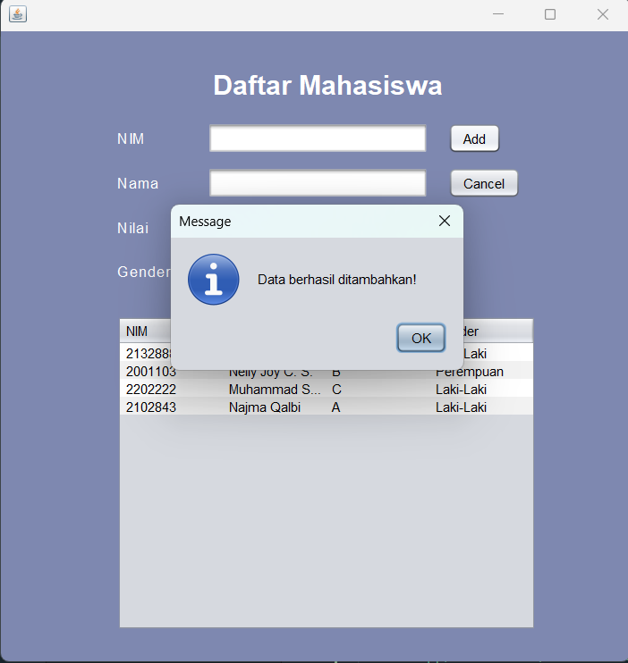

#LATIHAN5DPBO2023

Saya Najma Qalbi Dwiharani dengan NIM 2102843 mengerjakan soal Latihan 5 dalam mata kuliah Desain dan Pemrograman Berorientasi Objek untuk keberkahanNya maka saya tidak melakukan kecurangan seperti yang telah dispesifikasikan. Aamiin.

## Desain Program

Program ini terdiri dari kelas mahasiswa dan JFrame:

#### 1. Kelas Mahasiswa
Kelas ini memiliki atribut :
- nim
- nama
- nilai
- gender

Method yang ada pada kelas ini merupakan setter dan getter untuk tiap atribut.

## Penjelasan Alur dan Dokumentasi

1. Tampilan Awal

    

2. Mengisi Data Baru

    

- Insert Success
    
    Data akan masuk ke dalam tabel dan terdapat message sukses, form juga kembali kosong.

    

- Cancel

    Data akan kembali kosong jika menekan tombol cancel.

    

3. Edit Data

    Jika menekan data pada tabel maka data akan ada di form dan muncul tombol update serta delete. Data dapat diedit pada form ini.

    

- Update success

    Jika menekan tombol update maka data akan diperbarui dan terdapat message data berhasil diubah, form juga kembali kosong.

    

- Update cancel

    Jika menekan tombol cancel maka data form akan kembali kosong dan tombol update serta delete tidak ada lagi.

    

- Delete

    Jika menekan tombol delete maka akan muncul dialog untuk konfirmasi apakah benar-benar akan menghapus.

    

- Delete success (yes)

    Jika menekan tombol yes maka data akan dihapus dan hilang dari tabel, kemudian form juga akan kembali kosong dan terdapat message data berhasil dihapus.

     

- Delete cancel (no)

    Jika menekan tombol no maka akan kembali seperti sebelumnya.

    
